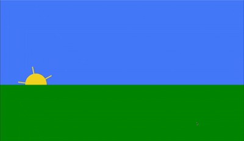

## Aufgabe 1

Erstelle eine einfache Szenerie mit grüner Wiese und blauem Himmel und einer scheinenden Sonne mit Sonnenstrahlen. Die Aufgabe ist, die Sonne um die eigene Achse zu drehen. <b>Optional</b> kann auch der Verlauf der Sonne animiert werden.

Beispiel:

## Aufgabe 2
